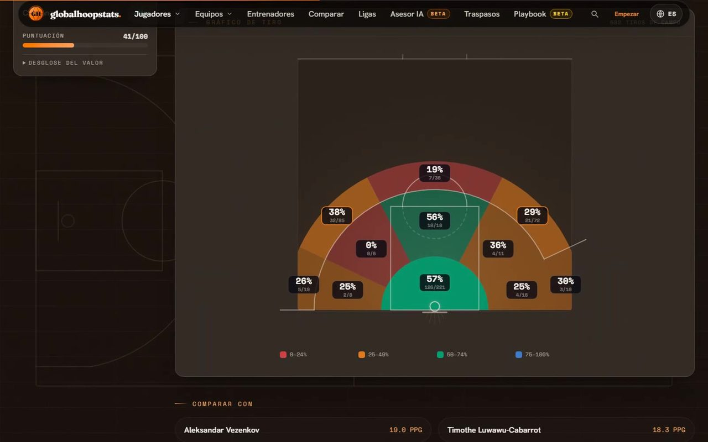
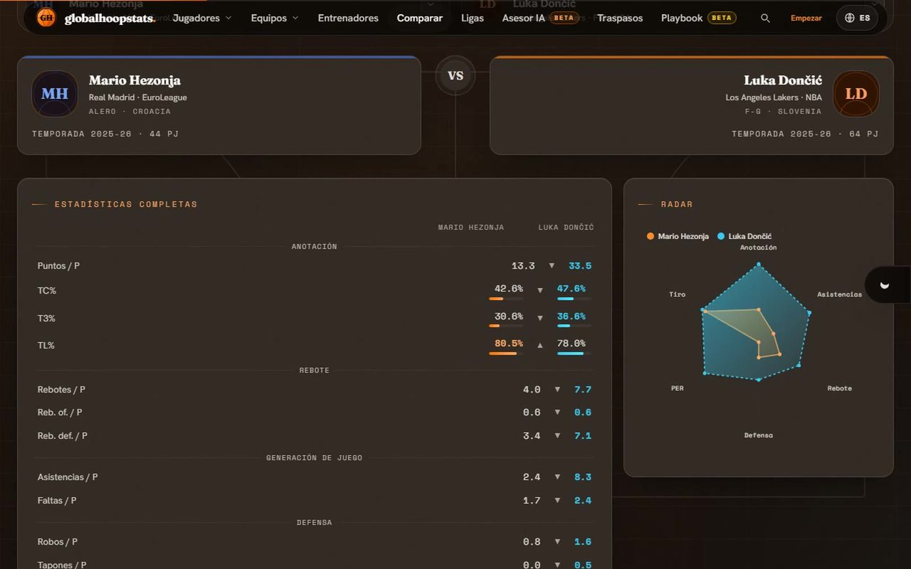
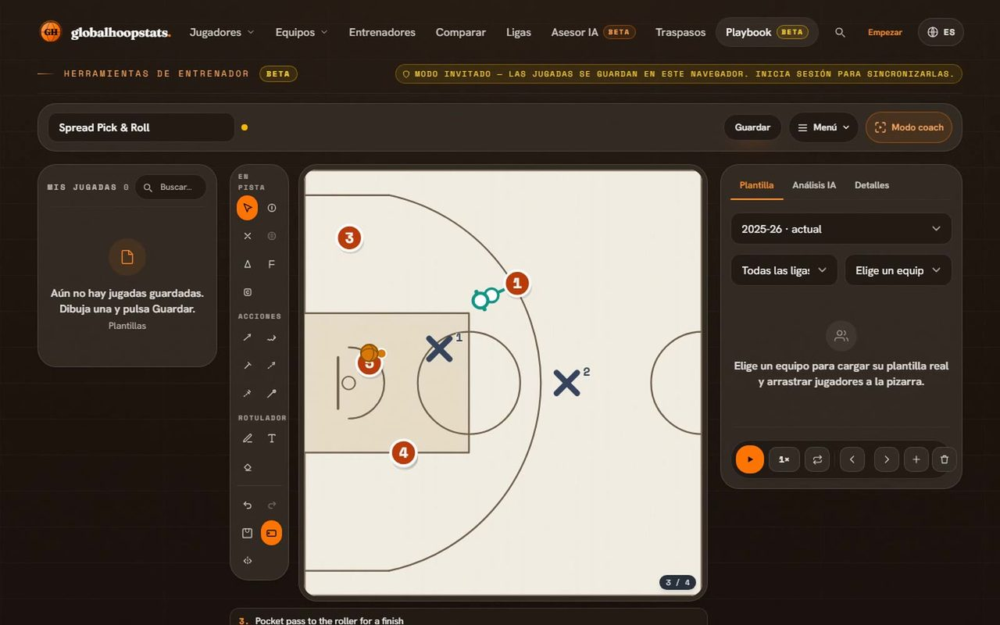
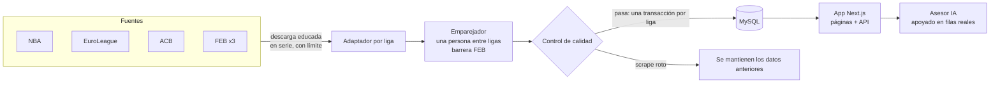

<div align="center">


# globalhoopstats

[English](README.md) · **Español**

Las estadísticas de baloncesto de todas las ligas, normalizadas en una sola web bilingüe,
con un asesor de scouting con IA, un simulador de traspasos y un playbook animado.

[](https://github.com/Hredo/globalhoopstats/actions/workflows/ci.yml)
[](https://globalhoopstats.es)
[](https://nextjs.org/)
[](https://www.typescriptlang.org/)
[](tests/README.md)
[](#idiomas)
[](LICENSE.txt)

**[→ Abrir globalhoopstats.es](https://globalhoopstats.es)**

<a href="https://globalhoopstats.es"></a>

<sub>Arranque del vídeo promocional, montado con imágenes reales de la web — ver <a href="#vídeos-e-imágenes">Vídeos e imágenes</a>.</sub>

</div>

---

## Índice

- [Qué es](#qué-es)
- [Un vistazo](#un-vistazo)
- [Ligas](#ligas)
- [Qué hace](#qué-hace)
- [Cómo funciona](#cómo-funciona)
- [Tecnología](#tecnología)
- [Puesta en marcha](#puesta-en-marcha)
- [Comandos](#comandos)
- [Estructura](#estructura)
- [Calidad y seguridad](#calidad-y-seguridad)
- [Despliegue](#despliegue)
- [Vídeos e imágenes](#vídeos-e-imágenes)
- [Documentación](#documentación)
- [Contribuir, seguridad y licencia](#contribuir-seguridad-y-licencia)

---

## Qué es

Los datos de baloncesto están desperdigados: la NBA, la EuroLeague, la ACB y las tres
categorías FEB publican cada una a su manera, en su web y con nombres distintos para las
mismas personas. globalhoopstats los recoge todos y resuelve **una única identidad por
persona entre ligas** —un jugador de EuroLeague y su línea de Liga Endesa viven en la misma
ficha— y encima construye un producto pensado para entrenadores: comparativas, valor de
mercado, traspasos, un asesor IA que responde con la base de datos y un editor de jugadas.

Es una web en producción, no una demo: cuentas reales con doble factor, secretos de los
usuarios cifrados, límites de peticiones, una CSP con nonce, SEO y PWA instalable, en
español e inglés.

---

## Un vistazo

<table>
  <tr>
    <td width="50%" valign="top">
      <a href="https://globalhoopstats.es/players"></a>
      <p><b>Ficha de jugador</b> — una persona en varias ligas: cambia entre su EuroLeague y su Liga Endesa, valor de mercado, zonas de tiro reales y jugadores comparables.</p>
    </td>
    <td width="50%" valign="top">
      <a href="https://globalhoopstats.es/compare"></a>
      <p><b>Comparador</b> — dos jugadores cualesquiera, de cualquier liga, cara a cara; el líder de cada fila aparece coloreado.</p>
    </td>
  </tr>
  <tr>
    <td width="50%" valign="top">
      <a href="https://globalhoopstats.es/playbook"></a>
      <p><b>Playbook</b> — 109 plantillas, herramientas de dibujo, fotogramas que se animan, plantillas reales de equipos, exportación a PDF/PNG y análisis con IA.</p>
    </td>
    <td width="50%" valign="top">
      <a href="https://globalhoopstats.es/market/trade"></a>
      <p><b>Traspasos</b> — valoraciones de mercado ajustadas por liga, edad y producción; simula un mercado o equilibra un intercambio.</p>
    </td>
  </tr>
</table>

---

## Ligas

| Región | Competiciones | Fuente |
| --- | --- | --- |
| Estados Unidos | NBA | stats.nba.com, Basketball-Reference |
| Europa | EuroLeague | Basketball-Reference, feed de tiros de la EuroLeague |
| España | Liga Endesa (ACB) · Primera FEB · Segunda FEB · Tercera FEB | acb.com, baloncestoenvivo.feb.es |

Cómo se descarga cada fuente y las normas que cumple el scraper están en
[DATA-SOURCES.md](DATA-SOURCES.md).

---

## Qué hace

**Datos**
- Jugadores, equipos y cuerpos técnicos con líneas por liga y por temporada; la última
  temporada por defecto y cualquier anterior a demanda.
- Zonas de tiro reales donde la liga las publica (EuroLeague, NBA); ocultas, nunca
  inventadas, donde no.
- Valor de mercado normalizado por liga; exportación a PDF, Word y Excel.

**Herramientas para entrenadores**
- **Asesor IA** — preguntas de scouting respondidas con las cifras reales de la base, listas
  cerradas de candidatos y la plantilla del propio usuario. Cada usuario trae su clave:
  19 proveedores (o un Ollama local), claves cifradas y el modelo más nuevo elegido solo.
- **Comparador**, **traspasos** y **playbook** (arriba).

**Plataforma**
- Cuentas con doble factor por correo y dispositivos de confianza, gestión de cuenta y de
  sesiones.
- Bilingüe de punta a punta, SEO en todas las rutas (páginas de liga indexables, JSON-LD),
  PWA instalable.

<a id="idiomas"></a>

---

## Cómo funciona



- **Ingesta** — cada liga tiene un adaptador con el mismo contrato; todas las peticiones
  pasan por `src/lib/sources/fetcher.ts` (user agent identificable, una petición a la vez
  por servidor, respeta `Retry-After`).
- **Identidad** — el emparejador junta las líneas de una persona entre ligas, pero un
  jugador FEB nunca se fusiona con un profesional ACB/EuroLeague/NBA del mismo nombre.
- **Red de seguridad** — el control de calidad rechaza un scrape sospechoso, así que una
  página rota de la fuente nunca pisa datos buenos.
- **Programación** — en producción solo hay artefactos de compilación, así que la
  sincronización programada es una ruta HTTP autenticada que llama el cron del hosting
  ([docs/SYNC.md](docs/SYNC.md)).

El diseño completo —modelo de datos, emparejador, autenticación, IA— está en
[docs/ARCHITECTURE.es.md](docs/ARCHITECTURE.es.md).

---

## Tecnología

| Capa | Tecnología |
| --- | --- |
| Framework | Next.js 15 (App Router), React 19, TypeScript estricto |
| Interfaz | Tailwind CSS 4, Motion (`motion/react`), Three.js, Fraunces · Hanken Grotesk · Space Mono |
| Datos | MySQL con `mysql2` + Drizzle ORM |
| Autenticación | Sesiones HMAC propias, bcrypt, doble factor por correo |
| IA | 19 proveedores + Ollama, clave propia, cifrado AES-256-GCM |
| Correo | Nodemailer (Resend / Gmail SMTP) |
| PWA | Serwist |
| Calidad | Vitest, ESLint, Prettier, GitHub Actions |

---

## Puesta en marcha

**Requisitos:** Node.js 20+, pnpm 11 y una base MySQL 8 / MariaDB. Opcional: Ollama para un
modelo de IA local.

```bash
pnpm install
cp .env.example .env.local      # rellena DATABASE_URL y el resto
pnpm db:push                    # crea el esquema
pnpm sync:elite                 # carga NBA, ACB y EuroLeague
pnpm dev                        # http://localhost:3000
```

Todas las variables están explicadas en [.env.example](.env.example). En producción
`SESSION_SECRET` y `ENCRYPTION_KEY` son obligatorias: sin ellas la app no arranca.

---

## Comandos

| Comando | Qué hace |
| --- | --- |
| `pnpm dev` | Servidor de desarrollo (Turbopack) |
| `pnpm typecheck` · `pnpm lint` · `pnpm test` | Las tres comprobaciones de la CI |
| `pnpm db:push` · `pnpm db:studio` | Aplicar el esquema de Drizzle · explorar los datos |
| `pnpm sync:elite` · `pnpm sync:feb` · `pnpm sync:<liga>` | Cargar ligas |
| `pnpm probe:season` | Ver qué fuentes publican ya la nueva temporada |
| `pnpm db:dedupe-players` | Fusionar personas duplicadas entre ligas |
| `pnpm backfill:*` | Rellenos puntuales (biografías, colores, zonas de tiro…) |
| `pnpm capture:showcase` | Regrabar los clips de producto de la portada ([Vídeos](#vídeos-e-imágenes)) |

---

## Estructura

```
src/
├─ app/            páginas y rutas de la API (App Router)
├─ components/     interfaz, por funcionalidad (players, market, playbook, marketing…)
└─ lib/
   ├─ sources/     un adaptador por liga + la descarga educada
   ├─ sync/        orquestación, control de calidad, emparejador
   ├─ ai/          proveedores, ranking de modelos, respuestas apoyadas en datos
   ├─ auth/        sesiones, doble factor, contraseñas
   ├─ security/    CSP, límites, IP del cliente, filtrado de prompts
   ├─ i18n/        diccionarios ES/EN
   └─ db/          esquema y cliente de Drizzle
scripts/           sincronización, rellenos, mantenimiento, grabador de clips
tests/             unitarios · componentes · regresiones de seguridad
docs/              arquitectura (EN/ES), sincronización
```

---

## Calidad y seguridad

- **CI** en cada push y pull request: tipos, lint, tests y auditoría de las dependencias de
  producción, con las acciones fijadas por commit y un token de solo lectura.
- **494 tests**, incluidas regresiones de seguridad: redirecciones abiertas, suplantación de
  la IP del cliente, el tope de intentos del doble factor, inyección de fórmulas en CSV,
  inyección de instrucciones en todas las rutas de IA, XSS por enlaces markdown e inyección
  SQL.
- **Defensas activas:** sesiones HMAC ligadas a filas del servidor, doble factor con
  intentos contados de forma atómica, límites por IP y por cuenta, comprobación de origen
  en toda llamada que modifica datos, CSP con nonce por petición, AES-256-GCM para las
  claves de los usuarios, endpoints de IA protegidos contra SSRF y secretos eliminados de
  los errores de los proveedores.

¿Has encontrado una vulnerabilidad? Avisa en privado: mira [SECURITY.md](SECURITY.md).

---

## Despliegue

La web corre como un servidor Node.js en Hostinger detrás de Cloudflare, con MySQL en la
misma máquina. Al servidor solo llega lo compilado (`.next/`, los `node_modules/` de
ejecución y `server.js`): ni repositorio, ni pnpm, ni tsx. Por eso todo lo que tiene que
ejecutarse en producción, la sincronización programada incluida, es accesible desde la app
compilada.

---

## Vídeos e imágenes

- **Clips de producto de la portada** — grabados de la app en marcha, en los dos temas y
  los dos idiomas, con `pnpm capture:showcase` (fotogramas del screencast de Playwright
  codificados con ffmpeg). En las escenas con sesión la cuenta se difumina antes de guardar
  ningún fotograma.
- **Vídeo promocional** — 45 segundos en ES y EN, horizontal (1920×1080) y vertical
  (1080×1920), montado con Remotion a partir de esas mismas imágenes y del film del balón.

---

## Documentación

| Documento | Contenido |
| --- | --- |
| [docs/ARCHITECTURE.es.md](docs/ARCHITECTURE.es.md) · [EN](docs/ARCHITECTURE.en.md) | Modelo de datos, ingesta, emparejador, autenticación, IA, recetas |
| [DATA-SOURCES.md](DATA-SOURCES.md) | Fuentes, principios, control de calidad, cambio de temporada |
| [docs/SYNC.md](docs/SYNC.md) | Sincronización programada, garantías, cadencia |
| [tests/README.md](tests/README.md) | Cómo está organizada la batería de tests |

---

## Contribuir, seguridad y licencia

- Los fallos y correcciones de datos son bienvenidos como
  [issues](https://github.com/Hredo/globalhoopstats/issues/new/choose); el código, previo
  acuerdo: mira [CONTRIBUTING](.github/CONTRIBUTING.md).
- Vulnerabilidades: en privado, como explica [SECURITY.md](SECURITY.md).
- **Propietario** — © 2026 Hugo Redondo Valdés. El código es público como referencia;
  cualquier otro uso necesita permiso por escrito ([LICENSE.txt](LICENSE.txt)). Sin relación
  con la NBA, la EuroLeague, la ACB ni la FEB.

Hecho por [Hugo Redondo Valdés](https://github.com/Hredo), entrenador de baloncesto y
desarrollador.
