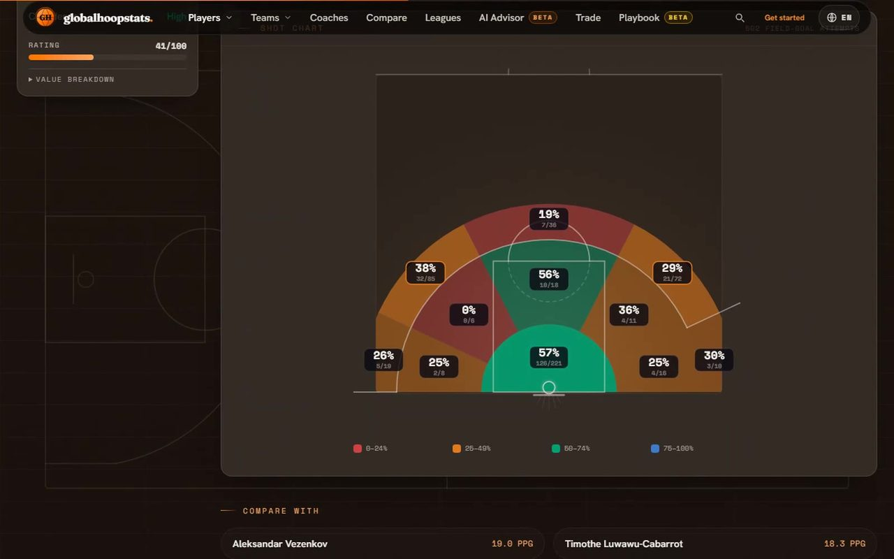
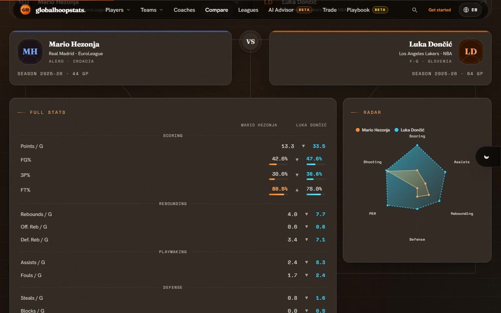
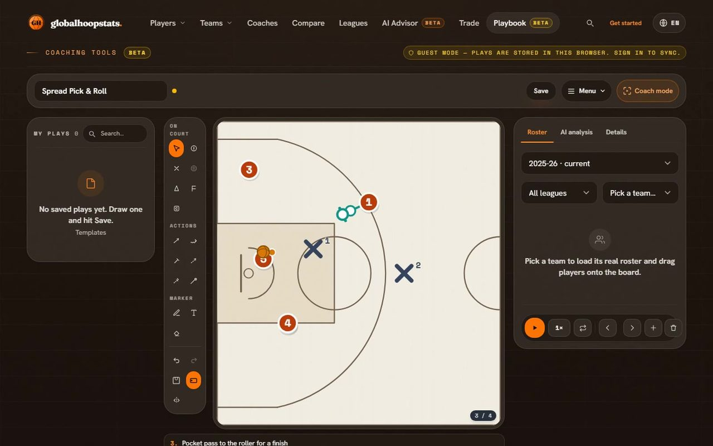
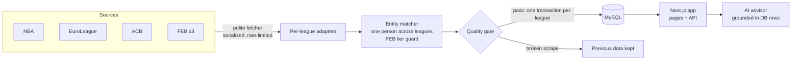

<div align="center">


# globalhoopstats

**English** · [Español](README.es.md)

Every league's basketball statistics, normalized into one bilingual app —
with an AI scouting advisor, a trade simulator and an animated playbook.

[](https://github.com/Hredo/globalhoopstats/actions/workflows/ci.yml)
[](https://globalhoopstats.es)
[](https://nextjs.org/)
[](https://www.typescriptlang.org/)
[](tests/README.md)
[](#internationalization)
[](LICENSE.txt)

**[→ Open globalhoopstats.es](https://globalhoopstats.es)**

<a href="https://globalhoopstats.es"></a>

<sub>Opening of the promo video, rendered from the real app's footage — see <a href="#media">Media</a>.</sub>

</div>

---

## Contents

- [What it is](#what-it-is)
- [A quick look](#a-quick-look)
- [Leagues](#leagues)
- [What it does](#what-it-does)
- [How it works](#how-it-works)
- [Stack](#stack)
- [Getting started](#getting-started)
- [Scripts](#scripts)
- [Project layout](#project-layout)
- [Quality and security](#quality-and-security)
- [Deployment](#deployment)
- [Media](#media)
- [Documentation](#documentation)
- [Contributing, security and license](#contributing-security-and-license)

---

## What it is

Basketball data is scattered: the NBA, the EuroLeague, the ACB and the three FEB tiers each
publish their numbers in a different shape, on a different site, with different names for
the same people. globalhoopstats ingests all of them and resolves **one canonical identity
per person across leagues** — a EuroLeague player and his Liga Endesa line live on the same
profile — and builds a coach-oriented product on top: comparisons, market value, trades,
an AI advisor that answers from the database and a playbook editor.

It is a production web app, not a demo: real accounts with two-factor authentication,
encrypted user secrets, rate limiting, a nonce-based CSP, SEO and an installable PWA, in
Spanish and English.

---

## A quick look

<table>
  <tr>
    <td width="50%" valign="top">
      <a href="https://globalhoopstats.es/players"></a>
      <p><b>Player profile</b> — one person across leagues: switch between his EuroLeague and Liga Endesa lines, market value, real shooting zones, comparables.</p>
    </td>
    <td width="50%" valign="top">
      <a href="https://globalhoopstats.es/compare"></a>
      <p><b>Compare</b> — any two players from any league, head to head; the leader of each line is coloured.</p>
    </td>
  </tr>
  <tr>
    <td width="50%" valign="top">
      <a href="https://globalhoopstats.es/playbook"></a>
      <p><b>Playbook</b> — 109 templates, drawing tools, frames that animate, real rosters, PDF/PNG export and AI analysis.</p>
    </td>
    <td width="50%" valign="top">
      <a href="https://globalhoopstats.es/market/trade"></a>
      <p><b>Trade simulator</b> — market valuations adjusted by league, age and production; simulate a market or balance a swap.</p>
    </td>
  </tr>
</table>

---

## Leagues

| Region | Competitions | Source |
| --- | --- | --- |
| United States | NBA | stats.nba.com, Basketball-Reference |
| Europe | EuroLeague | Basketball-Reference, EuroLeague's shot feed |
| Spain | Liga Endesa (ACB) · Primera FEB · Segunda FEB · Tercera FEB | acb.com, baloncestoenvivo.feb.es |

How each source is fetched, and the rules the scraper keeps, are in
[DATA-SOURCES.md](DATA-SOURCES.md).

---

## What it does

**Data**
- Players, teams and coaching staff with per-league, per-season lines; the latest season
  by default and any previous one on demand.
- Real shooting zones where the league publishes them (EuroLeague, NBA); hidden, never
  faked, where it does not.
- Market valuation normalized per league; exports to PDF, Word and Excel.

**Tools for coaches**
- **AI advisor** — scouting questions answered with the database's real numbers, closed
  candidate lists and the user's own roster. Bring your own key: 19 providers (or a local
  Ollama), keys encrypted at rest, the newest model picked automatically.
- **Compare**, **trade simulator** and **playbook** (above).

**Platform**
- Accounts with email-code 2FA and trusted devices, account and session management.
- Bilingual end to end, SEO for every route (crawlable league pages, JSON-LD), installable
  PWA.

<a id="internationalization"></a>

---

## How it works



- **Ingestion** — each league has an adapter behind one contract; every request goes
  through `src/lib/sources/fetcher.ts` (identifiable user agent, one request at a time per
  host, honours `Retry-After`).
- **Identity** — the matcher merges a person's lines across leagues, but a FEB player is
  never fused with an ACB/EuroLeague/NBA professional of the same name.
- **Safety net** — a quality gate refuses a suspicious scrape, so a broken source page can
  never overwrite good data.
- **Scheduling** — production runs only build artifacts, so the scheduled sync is an
  authenticated HTTP route called by the host's cron ([docs/SYNC.md](docs/SYNC.md)).

The full design — data model, matcher, auth, AI pipeline — is in
[docs/ARCHITECTURE.en.md](docs/ARCHITECTURE.en.md).

---

## Stack

| Layer | Technology |
| --- | --- |
| Framework | Next.js 15 (App Router), React 19, TypeScript strict |
| UI | Tailwind CSS 4, Motion (`motion/react`), Three.js, Fraunces · Hanken Grotesk · Space Mono |
| Data | MySQL via `mysql2` + Drizzle ORM |
| Auth | Own HMAC sessions, bcrypt, email-code 2FA |
| AI | 19 providers + Ollama, BYOK, AES-256-GCM key storage |
| Email | Nodemailer (Resend / Gmail SMTP) |
| PWA | Serwist |
| Quality | Vitest, ESLint, Prettier, GitHub Actions |

---

## Getting started

**Requirements:** Node.js 20+, pnpm 11, a MySQL 8 / MariaDB database. Optional: Ollama
for a local AI model.

```bash
pnpm install
cp .env.example .env.local      # fill in DATABASE_URL and the rest
pnpm db:push                    # create the schema
pnpm sync:elite                 # ingest NBA, ACB and EuroLeague
pnpm dev                        # http://localhost:3000
```

Every variable is documented in [.env.example](.env.example). In production
`SESSION_SECRET` and `ENCRYPTION_KEY` are mandatory — the app refuses to boot without them.

---

## Scripts

| Command | What it does |
| --- | --- |
| `pnpm dev` | Dev server (Turbopack) |
| `pnpm typecheck` · `pnpm lint` · `pnpm test` | The three gates CI runs |
| `pnpm db:push` · `pnpm db:studio` | Apply the Drizzle schema · browse the data |
| `pnpm sync:elite` · `pnpm sync:feb` · `pnpm sync:<league>` | Ingest leagues |
| `pnpm probe:season` | Check which sources already publish the new season |
| `pnpm db:dedupe-players` | Merge duplicated people across leagues |
| `pnpm backfill:*` | Targeted backfills (bios, colours, shot zones…) |
| `pnpm capture:showcase` | Re-record the homepage product clips ([Media](#media)) |

---

## Project layout

```
src/
├─ app/            pages and API routes (App Router)
├─ components/     UI, by feature (players, market, playbook, marketing…)
└─ lib/
   ├─ sources/     one adapter per league + the polite fetcher
   ├─ sync/        orchestration, quality gate, matcher
   ├─ ai/          providers, model ranking, grounded answer pipeline
   ├─ auth/        sessions, 2FA, passwords
   ├─ security/    CSP, rate limits, client IP, prompt screening
   ├─ i18n/        ES/EN dictionaries
   └─ db/          Drizzle schema and client
scripts/           sync, backfills, maintenance, showcase recorder
tests/             unit · components · security regression tests
docs/              architecture (EN/ES), sync
```

---

## Quality and security

- **CI** on every push and pull request: typecheck, lint, the test suite and a production
  dependency audit, with actions pinned to commits and a read-only token.
- **494 tests**, including security regressions: open redirects, client-IP spoofing, the
  2FA attempt cap, CSV formula injection, prompt injection on every AI route, markdown-link
  XSS and SQL injection.
- **Defences in place:** HMAC sessions bound to server-side rows, 2FA with atomic attempt
  counting, per-IP and per-account limits, origin checks on every state-changing API call,
  a per-request nonce CSP, AES-256-GCM for user keys, SSRF-safe AI endpoints, and secrets
  stripped from provider errors.

Found a vulnerability? Please report it privately — see [SECURITY.md](SECURITY.md).

---

## Deployment

The site runs as a long-lived Node.js server on Hostinger behind Cloudflare, with MySQL on
the same machine. The server only receives the build output (`.next/`, runtime
`node_modules/`, `server.js`) — no repository, no pnpm, no tsx — which is why everything
that must run in production, the scheduled sync included, is reachable from the built app.

---

## Media

- **Homepage product clips** — recorded from the running app in both themes and both
  languages with `pnpm capture:showcase` (Playwright screencast frames, encoded with
  ffmpeg). Signed-in scenes blur the account before any frame is kept.
- **Promo video** — a 45-second piece in ES and EN, horizontal (1920×1080) and vertical
  (1080×1920), built with Remotion from the same footage and the hero film.

---

## Documentation

| Document | Contents |
| --- | --- |
| [docs/ARCHITECTURE.en.md](docs/ARCHITECTURE.en.md) · [ES](docs/ARCHITECTURE.es.md) | Data model, ingestion, matcher, auth, AI engine, onboarding recipes |
| [DATA-SOURCES.md](DATA-SOURCES.md) | Sources, sourcing principles, quality gate, season rollover |
| [docs/SYNC.md](docs/SYNC.md) | Scheduled sync, integrity guarantees, cadence |
| [tests/README.md](tests/README.md) | How the suite is organized |

---

## Contributing, security and license

- Bug reports and data corrections are welcome as
  [issues](https://github.com/Hredo/globalhoopstats/issues/new/choose); code contributions
  by prior agreement — see [CONTRIBUTING](.github/CONTRIBUTING.md).
- Vulnerabilities: privately, as described in [SECURITY.md](SECURITY.md).
- **Proprietary** — © 2026 Hugo Redondo Valdés. The source is public for reference; any
  other use needs written permission ([LICENSE.txt](LICENSE.txt)). Not affiliated with the
  NBA, EuroLeague, ACB or FEB.

Made by [Hugo Redondo Valdés](https://github.com/Hredo) — basketball coach and developer.
