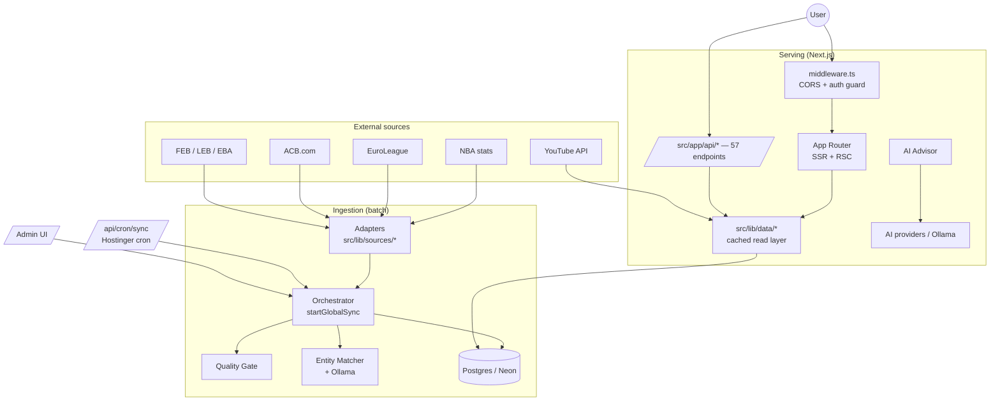
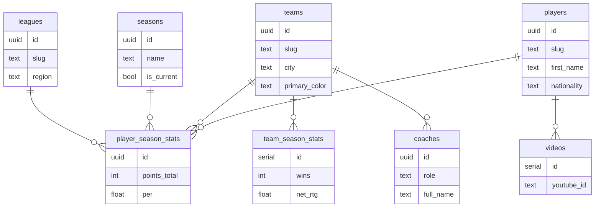

# GlobalHoopStats — Architecture & Developer Guide

**Idioma / Language:** [Español](ARCHITECTURE.es.md) · English

> Internal technical documentation. Its goal is to let **any new programmer understand the whole system** —
> what it does, how it is built, how data flows and where to touch for each kind of change — without having to
> reverse‑engineer 327 files.
>
> It complements the [`README.md`](../README.md) (product vision + quick start). If they disagree, **the code wins**.

**Document last revised:** 2026‑06‑30 · **Stack:** Next.js 15 (App Router) · React 19 · TypeScript strict · Postgres (Neon) · Drizzle ORM.

---

## Table of contents

1. [What GlobalHoopStats is](#1-what-globalhoopstats-is)
2. [Tech stack](#2-tech-stack)
3. [High‑level architecture](#3-high-level-architecture)
4. [Repository structure](#4-repository-structure)
5. [Data model](#5-data-model)
6. [Ingestion pipeline (the heart of the system)](#6-ingestion-pipeline-the-heart-of-the-system)
7. [Web layer: App Router, rendering & i18n](#7-web-layer-app-router-rendering--i18n)
8. [REST API](#8-rest-api)
9. [Authentication & security](#9-authentication--security)
10. [AI engine (advisor + comparator + market)](#10-ai-engine-advisor--comparator--market)
11. [Market, valuation & trade simulator](#11-market-valuation--trade-simulator)
12. [Plans & billing](#12-plans--billing)
13. [Configuration & environment variables](#13-configuration--environment-variables)
14. [Scripts & operations](#14-scripts--operations)
15. [Testing](#15-testing)
16. [Deployment](#16-deployment)
17. [Onboarding: recipes by task](#17-onboarding-recipes-by-task)
18. [Glossary & design decisions](#18-glossary--design-decisions)

---

## 1. What GlobalHoopStats is

GlobalHoopStats is a **multi‑league basketball statistics platform**. It aggregates, **normalizes** and visualizes
data from competitions that publish their information in completely different formats, unifying them into a single,
fast, **bilingual (ES/EN)** web app.

**Supported leagues** (see `src/lib/sources/types.ts`):

| Region | Competitions | `SourceId` |
| --- | --- | --- |
| 🇺🇸 North America | NBA | `nba` |
| 🇪🇺 Europe | EuroLeague | `euroleague` |
| 🇪🇸 Spain | Liga Endesa (ACB) | `acb` |
| 🇪🇸 Spain (FEB) | LEB Oro · LEB Plata · EBA | `leb-oro`, `leb-plata`, `eba` |

On top of that unified database, three products are built:

- **Directories & profiles**: players, teams and coaching staff, with per‑league stats, bios, visual identity
  (logos/colors) and YouTube highlights. Side‑by‑side player comparison.
- **AI Advisor**: a conversational scouting assistant that reasons like a front‑office director. Each user brings
  **their own AI key** (BYOK) or uses a local model.
- **Market**: a signing/trade simulator with estimated **market valuation** and currency handling.

The differentiator (the "moat") is **not** rendering tables: it is the **normalization engine** that turns
heterogeneous, dirty sources into a single canonical identity per person/team, even when a player moves between leagues.

---

## 2. Tech stack

| Layer | Technology | Notes |
| --- | --- | --- |
| Framework | **Next.js 15** (App Router) + **React 19** | `next dev --turbopack` in development |
| Language | **TypeScript** (strict) | alias `@/*` → `src/*` |
| Styling | **Tailwind CSS 4** + **Framer Motion** | `@tailwindcss/postcss` |
| Database | **Postgres** (Neon serverless) | `postgres` driver with `prepare: false` |
| ORM / migrations | **Drizzle ORM** + **Drizzle Kit** | schema in TS, `db:push` as the primary flow |
| Auth | Custom sessions (HMAC), `bcryptjs`, email‑code 2FA | no external auth library |
| Email | **Nodemailer** | Resend → Gmail SMTP → console transports |
| AI | **Ollama** (local) + OpenAI‑compatible providers (BYOK) | native web search on Anthropic/Gemini |
| Validation | **Zod** | env, API payloads |
| PWA | **Serwist** | Turbopack‑compatible service worker |
| Export | `jspdf`, `docx`, `xlsx-js-style` | PDF/Word/Excel reports |
| Tooling | **pnpm 11**, ESLint, Prettier, **Vitest**, `tsx` | Node 20.x |

**Environment requirements:** Node 20.x · pnpm 11.x · a Postgres database · (optional) Ollama with `llama3.1:8b`.

---

## 3. High‑level architecture

There are **two planes** that are best kept mentally separate:

- **Ingestion plane (offline/batch):** scripts and cron that fill the DB from external sources.
- **Serving plane (online/request):** the Next.js app that reads that DB and serves pages + API to users.

Both share **the same Drizzle schema** and the same DB client, but run in different contexts.



**Key idea:** pages almost never talk to the DB directly; they go through `src/lib/data/*`, which centralizes queries
and caching. Ingestion does write straight through the orchestrator.

---

## 4. Repository structure

```
src/
├─ app/                      # App Router (pages + API)
│  ├─ [locale]/              # language‑routed pages (en/es)
│  ├─ players/ teams/ coaches/ leagues/ compare/   # core stats views
│  ├─ market/               # market simulator + valuation
│  ├─ ai-advisor/ ai-setup/ # AI assistant + BYOK config
│  ├─ account/ login/ register/ reset-password/    # auth & accounts
│  ├─ admin/                # internal panel (sync, users, announcements, analytics)
│  ├─ the-index/            # "El Índice" editorial section
│  └─ api/                  # 57 REST endpoints (route.ts)
├─ components/              # reusable UI, grouped by domain
│  ├─ ui/ layout/ auth/ account/ admin/
│  ├─ players/ teams/ leagues/ staff/ scouting/ market/
│  └─ marketing/ animations/ svg/ index/
└─ lib/                     # all business logic (no React)
   ├─ sources/              # per‑league adapters (acb, euroleague, nba, feb)
   ├─ sync/                 # ingestion orchestration + entity matching
   ├─ data/                 # cached read layer (players, teams, …)
   ├─ db/                   # client + Drizzle schema + RLS helpers
   ├─ auth/                 # sessions, 2FA, password, guards
   ├─ ai/                   # advisor, providers, chat, intent, export
   ├─ market/               # valuation, trade, budgets, similarity
   ├─ security/             # rate-limit, secrets (encryption), ai-advisor guard
   ├─ billing/              # plans & catalog (Stripe seam)
   ├─ email/                # templates + transactional send
   ├─ i18n/                 # config, dictionaries, translation helpers
   ├─ seo/                  # JSON-LD / structured data
   └─ theme/                # team colors
scripts/                    # sync, backfills, dedupe, maintenance (tsx)
drizzle/                    # generated SQL migrations (gitignored, see §13)
tests/                      # Vitest: unit + security regressions
```

**Golden organizational rule:** `lib/` never imports from `components/` or `app/`. Business logic is React‑agnostic
and testable in isolation.

---

## 5. Data model

Single source of truth: **[`src/lib/db/schema.ts`](../src/lib/db/schema.ts)** (Drizzle). ~30 tables. Primary keys of
domain and user entities are `uuid` with `defaultRandom()`; event/counter tables use `serial`.

### 5.1 Domain (basketball data)



- **`players`** is the canonical table: **one row per person**, even if they play in several leagues. `slug` is unique.
- **`player_season_stats`** is the fact table: one row per `(player, team, league, season)` — a unique index that
  guarantees idempotent upserts during ingestion. It stores totals (not averages) plus advanced metrics
  (`per`, `true_shooting_pct`, `win_shares`, `bpm`).
- **`team_season_stats`** carries advanced team ratings (`off_rtg`, `def_rtg`, `net_rtg`, `pace`, `sos`).
- **`coaches`** hang off `(team, league)`; `role` ∈ `head_coach | assistant_coach | staff`.
- **`videos`** are YouTube highlights per player (`youtube_id` unique).

### 5.2 Identity, accounts & security

| Table | Purpose |
| --- | --- |
| `users` | account: email, password hash, `plan` (free/pro), `role` (user/admin), 2FA, Stripe fields |
| `sessions` | active sessions (id, expiry, user‑agent, IP) — supports revocation and "sign out other sessions" |
| `user_api_keys` | user AI keys **encrypted at rest** (AES‑256‑GCM); stores `last4` for display |
| `user_settings` | preferences: advisor and comparison provider/model, locale, currency, emails, *reduce motion* |
| `password_reset_tokens` | reset tokens (hash + expiry + used) |
| `two_factor_sessions` | email 2FA codes (hash, attempts, expiry) |
| `two_factor_backup_codes` | single‑use backup codes |

### 5.3 Product, content & operations

| Table | Purpose |
| --- | --- |
| `conversations` / `messages` | AI Advisor history (per user and team) |
| `compare_uses` | comparator usage log (for future per‑plan limits) |
| `waitlist_entries` | waitlist (email + source) |
| `announcements` | banners/notices with priority and date window |
| `app_config` | runtime‑mutable configuration (key/value) without redeploy |
| `page_views` / `search_log` | lightweight first‑party analytics (views and searches) |
| `sync_runs` | audit of each ingestion run (status, rows, error) |
| `rate_limits` | fixed‑window rate‑limiting counters (composite key) |

> TS types are auto‑derived at the end of the schema (`typeof table.$inferSelect`). Always use them instead of
> redefining shapes by hand. `userPlan(user)` resolves the effective plan: `admin` > `pro` > `free`.

---

## 6. Ingestion pipeline (the heart of the system)

Everything lives in `src/lib/sources/` (extraction) and `src/lib/sync/` (orchestration). This is the part with the
most non‑obvious design decisions; read it carefully.

### 6.1 Adapter contract

Each league implements **`SourceAdapter`** (`src/lib/sources/types.ts`): an object with metadata and methods that
return data **already normalized** to shared types (`SourceTeam`, `SourcePlayer`, `SourceCoach`,
`ExtractedPlayerStat`, `SourceTeamStats`):

```ts
type SourceAdapter = {
  id: SourceId; displayName: string; country: string; season: number; seasonCode: string
  fetchTeams(): Promise<SourceTeam[]>
  fetchPlayers(): Promise<SourcePlayer[]>
  fetchStats(): Promise<ExtractedPlayerStat[]>
  fetchCoaches(): Promise<SourceCoach[]>
  fetchTeamStats(): Promise<SourceTeamStats[]>
  fetchTeamDetails?(ids): Promise<...>   // optional enrichment
}
```

Registered adapters are in `src/lib/sources/index.ts`. The three FEB leagues are produced by a **factory**
(`createFebAdapter(FEB_CONFIGS)`) because they share scraping structure. Important FEB detail (see project memory):
the FEB scraper must **union all "Liga Regular" groups** (EBA has ~10) and the UI does **not** split by
group/conference.

`CURRENT_SEASON = 2025`, and `SOURCE_META` centralizes the season and `seasonCode` per league.

### 6.2 Orchestrator — `startGlobalSync()`

File: **[`src/lib/sync/orchestrator.ts`](../src/lib/sync/orchestrator.ts)**. It runs every league through the same
pipeline and holds **state shared across leagues** (key to cross‑league deduplication).

Per‑league steps (`syncLeague`):

1. **Open a `sync_runs` row** (`status: running`) for auditing.
2. **Upsert league + season** (memoized: "2025‑26" is shared by NBA/ACB/FEB and must not be duplicated in parallel).
3. **Fetch the full batch** (teams + players + stats) **before writing anything**.
4. **Quality Gate** (`evaluateScrape`): compares the batch against the last good sync. If the scrape looks broken
   (sharp drop in volume, etc.) it **aborts that league without touching the DB** and raises an alert. So a broken
   scrape **never overwrites good data**.
5. **Teams**: `ensureTeam` (get‑or‑create by slug, with incremental backfill of empty fields).
6. **Players**: each one goes through the **Entity Matcher** (§6.3) → reuse an existing person or create a new one.
7. **Stats**: `upsert` on the unique index `(player, team, league, season)` → idempotent.
8. **Coaches**: upsert with `coalesce` so already‑filled columns are never regressed to `null`.
9. **Close `sync_runs`** (`ok`/`failed`, rows written).

Global orchestrator properties:

- **Concurrency capped at 2 leagues** (`p-limit`) so the Neon pool and the sources aren't saturated.
- **Shared state**: the player identity registry, used slugs and team/season caches are common to all parallel jobs →
  a multi‑league player (e.g. Edy Tavares) ends up in **a single row**.
- **Self‑healing**: on startup it marks orphaned `running` rows older than 45 min (dead processes) as `failed`.
- **Cooperative cancellation**: checked between leagues, via an in‑process flag and a DB sentinel (admin "stop" + cron).
- **Revalidation**: if at least one league succeeded, it invalidates Next's cache tags to refresh pages.

### 6.3 Entity Matcher — cross‑league identity resolution

File: **[`src/lib/sync/entity-matcher.ts`](../src/lib/sync/entity-matcher.ts)**. It decides whether an incoming player
**is the same person** as one already known. Decision ladder, **cheapest to most expensive**:

```
1. Exact normalized‑name hit (tier‑compatible)            → reuse        (no LLM)
2. No candidate shares a name token                       → NEW          (no LLM)
3. Ambiguous ("Edy Tavares" vs "Walter Tavares")          → ask Ollama
4. Ollama down/unreachable                                → conservative heuristic
```

- **Ollama** (`llama3.1:8b` by default) acts as an **entity judge** only in ambiguous cases; it replies with strict
  JSON `{"playerId": "<id>" | "NEW"}`. It is given nationality/position/height as tie‑breakers.
- **Fault tolerance**: after 2 consecutive Ollama failures it is **disabled** for the rest of the run and falls back to
  the deterministic heuristic (same last name + same first initial **and** a single candidate → merge; anything weaker
  → new, because a duplicate is recoverable via `db:dedupe-players` but a wrong merge is not).
- **HARD TIER GUARD** (see `src/lib/leagues-tier.ts` and the *FEB tier exclusivity* memory): a **FEB (LEB/EBA) player is
  never the same person as an ACB/EL/NBA one**. Spain is full of amateur namesakes of professionals, so candidates with
  a conflicting *tier* are dropped from consideration **even on an exact name match**. This is applied at every rung of
  the ladder and is what prevents "Daniel García" (EBA) from being fused with "Daniel García" (ACB) when Ollama is down.

### 6.4 Deduplication & maintenance

Because ingestion biases toward "when in doubt, create" to avoid wrong merges, post‑hoc cleanup scripts exist
(`scripts/dedupe-players*.ts`, `merge-cross-league-teams.ts`, `split-feb-namesakes.ts`). They are **idempotent** and
rely on the same tier logic. There are dedicated tests (`tests/unit/entity-matcher-tier.test.ts`,
`tests/unit/quality-gate.test.ts`).

### 6.5 How ingestion is triggered

- **CLI** (manual/dev): `pnpm sync:global`, `pnpm sync:acb`, `pnpm sync:feb`, etc. (see §14).
- **Production cron**: `POST /api/cron/sync` with `Authorization: Bearer $CRON_SECRET` (Hostinger cron). It has an
  *overlap guard* (won't start a second sync if one is in progress) and **constant‑time** secret comparison.
- **Admin UI**: `/admin` → `api/admin/sync/{run,status,stop}` endpoints.

---

## 7. Web layer: App Router, rendering & i18n

### 7.1 App Router

Everything under `src/app/`. Server Components by default; views read data through **`src/lib/data/*`**
(`players.ts`, `teams.ts`, `leagues.ts`, `compare.ts`, `staff.ts`, `videos.ts`), which encapsulate Drizzle queries and
caching (`src/lib/data/cache.ts`). Dynamic pages use parameterized routes: `players/[slug]`, `teams/[league]/[slug]`.

### 7.2 Internationalization (ES/EN)

Config in `src/lib/i18n/config.ts`. Two patterns coexist (see *i18n two patterns* memory):

- **General UI**: dictionary + `useT` helper (`src/lib/i18n/dictionaries/`, `t.ts`, `server.ts`).
- **Legal/editorial content**: `getLocale` + bilingual components.

Language mechanics:

- Supported locales: `en` (default), `es`. Cookie **`ghs_locale`** (client‑readable, 1 year).
- Automatic selection via `pickFromAcceptLanguage()` (parses `Accept-Language` with `q` weights).
- There are routes under `[locale]/` and an `api/locale` endpoint to switch language. The **middleware does not** do
  language routing (only CORS + auth, see §9); the language is resolved by cookie/segment.

### 7.3 PWA and SEO

- **PWA** with Serwist (`next.config.mjs` wraps the config with `withSerwist`). The service worker is served from
  `app/serwist/` and the `public/sw*` artifacts are **gitignored** and **generated on every build** (which is why
  `public/` can look empty locally).
- **SEO**: sitemap, `robots`, OpenGraph and **JSON‑LD** (`src/lib/seo/structured-data.ts`). There are anti‑XSS tests on
  the JSON‑LD (`tests/unit/json-ld-xss.test.ts`).

---

## 8. REST API

**57 endpoints** (`route.ts`) under `src/app/api/`. Next.js convention: one function per HTTP verb. Validation with Zod.

| Group | Routes (summary) | Notes |
| --- | --- | --- |
| **Auth** | `auth/{login,register,logout,me,forgot-password,reset-password}`, `auth/2fa/{verify,resend}` | sessions + 2FA |
| **Account** | `account/{profile,password,settings,sessions,subscription}`, `account/2fa/*`, `account/api-keys/*` | requires login |
| **Data** | `players/*`, `teams/*`, `coaches/*`, `compare/players/*` | public reads |
| **AI** | `ai-advisor/*`, `compare/ai`, `players/ai`, `market/trade/ai`, `conversations/[id]/messages` | uses the user's BYOK |
| **Market** | `market/trade/*`, `players/[slug]/{valuation,similar}` | valuation + simulator |
| **Admin** | `admin/{sync,users,announcements,config,stats,analytics,cache}` | `role: admin` only |
| **Operations** | `cron/sync`, `revalidate`, `track/{page-view,search}`, `waitlist`, `contact`, `announcements/active`, `locale` | cron, analytics, ISR |

Security pattern: the **middleware** blocks by prefix (401/redirect) and each sensitive endpoint re‑checks
user/role with `src/lib/auth/guard.ts` (defense in depth).

---

## 9. Authentication & security

No external auth library: a small, audited, test‑covered custom implementation.

### 9.1 Sessions

File: `src/lib/auth/session.ts`.

- Composite token `header.payload.signature.sessionId`, signed with **HMAC‑SHA256** over `SESSION_SECRET`. Verification
  uses `timingSafeEqual` (timing‑attack resistant).
- Cookie **`ghs_session`**: `HttpOnly`, `SameSite=Lax`, `Secure` in production. Configurable TTL (`SESSION_TTL_DAYS`,
  default 30).
- The `sessions` row allows **revocation** and listing/closing other sessions from the account.

### 9.2 2FA and "remember this device"

- Email‑code 2FA (`two_factor_sessions`, with an attempt limit) + single‑use **backup codes**.
- A trust cookie **`ghs_trust`** to skip 2FA on a device: the token embeds a *binding* derived from the **current
  password hash**. So **any password change/reset implicitly revokes** all trust tokens, with no extra table.

### 9.3 Passwords and reset

- Hashing with `bcryptjs` (`src/lib/auth/password.ts`).
- Reset via a hashed, expiring token (`password_reset_tokens`); the email is sent through the transactional pipeline.

### 9.4 AI key encryption (BYOK)

- User keys are encrypted **AES‑256‑GCM** at rest (`src/lib/security/secrets.ts`) with `ENCRYPTION_KEY`.
- In dev, if `ENCRYPTION_KEY` is absent, one is derived from `SESSION_SECRET`; in **production it must be its own value**
  so that rotating the session secret never exposes keys. `last4` is stored for display without decryption.

### 9.5 Middleware, CORS and rate limiting

- `src/middleware.ts` (runtime **nodejs**): applies **CORS** with an origin allowlist (`SITE.url`,
  `NEXT_PUBLIC_SITE_URL`, localhost in dev) and an **auth guard** over protected prefixes (redirects to `/login` or
  returns 401 on the API).
- **Rate limiting** by fixed window in the `rate_limits` table (`src/lib/security/rate-limit.ts`), with
  **proxy‑aware real‑IP** resolution (`TRUSTED_PROXY_HOPS`) — the site sits behind Cloudflare.

### 9.6 Headers and CSP

`next.config.mjs` adds global security headers (HSTS 2 years, `X-Frame-Options: DENY`, `nosniff`, `Referrer-Policy`,
`Permissions-Policy`, COOP/COEP/CORP) and a **strict CSP**:

- In **production** `unsafe-eval` is removed (only needed for Turbopack HMR in dev) → an effective
  anti‑XSS/exfiltration CSP.
- The **`/ai-advisor/*`** route uses an **even stricter** CSP (no open `img-src https:`) because it renders
  LLM/user‑supplied content.

### 9.7 Prompt‑injection defense

The web context injected into the advisor is explicitly marked as **untrusted** in the system prompt, with the
instruction to **never** follow instructions appearing there (see `buildWebContext` in `src/lib/ai/llm.ts`). Tests live
in `tests/unit/ai-advisor-security.test.ts` and `tests/security/sql-injection-regression.test.ts`.

> Threat model and reporting policy: [`SECURITY.md`](../SECURITY.md).

---

## 10. AI engine (advisor + comparator + market)

### 10.1 BYOK (Bring Your Own Key)

Each user configures **their own provider and model** at `/ai-setup` (`user_api_keys` + `user_settings`). The system
ships no default provider in the environment: the **output quality depends on the model the user picks** (see *AI engine
quality ceiling* memory). The owner uses local Ollama 8B.

- `src/lib/ai/providers.ts` — provider catalog.
- `src/lib/ai/user-provider.ts` — resolves the effective "engine" per user/request (provider + model + decrypted key).
- `src/lib/ai/chat.ts` — `chatComplete()`: a unified OpenAI‑compatible client; `supportsNativeWebSearch()` enables
  native web search when the provider allows it (Anthropic/Gemini), avoiding an external search backend.

### 10.2 AI Advisor — "Basket Scout AI"

`src/lib/ai/llm.ts` builds the *system prompt*. It reasons like a GM: one clear decision, anchored to **verifiable**
data (real DB stats, valuation, club budget, roster gaps). Notable rules:

- It distinguishes **verified DB candidates** (with an estimated value) from "general knowledge" players, which it must
  tag `(fuera de BD — por confirmar)` and **never** fabricate stats/contracts for.
- It adapts the answer to the **detected operation type** (signing, trade, draft, release, renewal, loan, buyout,
  scouting) via `src/lib/ai/intent.ts`.
- It respects the club **budget** and the **cupo/passport** (nationality) requirement when the question demands it.
- Markdown output (~250–450 words), exportable to Word/PDF/Markdown (`src/lib/ai/export*.ts`).

History is persisted in `conversations`/`messages`; only the **last 8 turns** are sent to the model.

---

## 11. Market, valuation & trade simulator

Everything in `src/lib/market/`. It is a heuristic sub‑system that **estimates** (these are not real contractual data):

| Module | Responsibility |
| --- | --- |
| `valuation.ts` | a player's estimated market value and salary (0‑100 rating, *tier*, confidence) from their stats |
| `league-strength.ts` | per‑league strength factor + `formatEur` |
| `club-budgets.ts` | estimated club budget and a realistic cap for one signing (`singleSigningCap`) |
| `trade.ts` | builds trade scenarios that **balance the value** of the outgoing player |
| `candidates.ts` / `pool.ts` / `roster.ts` | priced candidate pool, filtered by league/feeders, and roster analysis |
| `similarity.ts` | similar players (statistical profile) |
| `nationality.ts` / `currency.ts` | cupo filters and currency conversion |
| `web-research.ts` | market context via web (treated as **untrusted**) |

These pieces feed both the market pages and the advisor's context (the `build*Context` functions in `llm.ts`).

---

## 12. Plans & billing

`src/lib/billing/` with client/server separation:

- `catalog.ts` (**pure, client‑safe**): plan definitions. **Free** (€0) and **Pro** (€9/mo, 30‑day period).
- `plans.ts` (**server**): `setUserPlan()` writes the `users` row.

Current state: switching to Pro is **self‑serve and free** (no payment yet). The *seam* is designed to plug in
**Stripe Checkout** without touching the UI: create a checkout session and have a webhook call `setUserPlan` on
`checkout.session.completed`. The `stripe*` fields already exist on `users`.

> **AI usage limits**: currently **disabled** (`src/lib/auth/free-usage.ts` returns `Infinity`); the code and the
> `compare_uses` table are ready to re‑enable them per plan.

---

## 13. Configuration & environment variables

Validated with Zod in **[`src/lib/env.ts`](../src/lib/env.ts)** (server + client schema, cached). In production the app
**refuses to boot** if `SESSION_SECRET` is still the dev value.

| Variable | Req. | Purpose |
| --- | --- | --- |
| `DATABASE_URL` | ✅ | Postgres/Neon (use the *pooled* endpoint in prod) |
| `SESSION_SECRET` | prod | HMAC for session tokens (≥32 chars) |
| `ENCRYPTION_KEY` | prod | AES‑256‑GCM to encrypt AI keys at rest |
| `NEXT_PUBLIC_SITE_URL` | ✅ | canonical URL (SEO/sitemap/OG/JSON‑LD, CORS) |
| `SESSION_TTL_DAYS` | opt. | session lifetime (1‑365, default 30) |
| `ADMIN_EMAILS` | opt. | administrator bootstrap |
| `CRON_SECRET` | opt. | protects `/api/cron/*` (≥16 chars) |
| `RESEND_API_KEY` / `GMAIL_APP_PASSWORD` | opt. | email transport |
| `AUTH_EMAIL_FROM` / `SMTP_HOST` / `SMTP_PORT` | opt. | sender and SMTP |
| `OLLAMA_BASE_URL` / `OLLAMA_MODEL` | opt. | local LLM (advisor + entity matcher) |
| `HUGGINGFACE_API_KEY` / `HUGGINGFACE_RERANK_MODEL` | opt. | highlight *rerank* |
| `TRUSTED_PROXY_HOPS` | opt. | proxy hops for real IP (Cloudflare) |
| `YOUTUBE_API_KEY` | opt. | YouTube highlights |

Generate secrets: `node -e "console.log(crypto.randomBytes(32).toString('base64'))"`. **Never** commit `.env*`.

### Migrations

`drizzle.config.ts` points to `src/lib/db/schema.ts` and emits to `drizzle/`. **The `drizzle/` directory is
gitignored**: the primary flow is **`pnpm db:push`** (pushes the TS schema to the DB); regenerate the SQL migrations
locally with `pnpm db:generate` when you need them.

---

## 14. Scripts & operations

Defined in `package.json` (run with `tsx`).

**Development & quality**

| Command | Action |
| --- | --- |
| `pnpm dev` | dev server (Turbopack) |
| `pnpm build` / `pnpm start` | production build / serve |
| `pnpm lint` · `pnpm typecheck` · `pnpm test` · `pnpm format` | ESLint · `tsc --noEmit` · Vitest · Prettier |

**Database**

| Command | Action |
| --- | --- |
| `pnpm db:push` | push the schema to the DB (primary flow) |
| `pnpm db:generate` · `pnpm db:studio` | generate migrations · open Drizzle Studio |
| `pnpm db:dedupe-players` · `pnpm db:cleanup-syncs` | deduplicate players · clean up stuck syncs |

**Ingestion & backfills**

| Command | Action |
| --- | --- |
| `pnpm sync:global` | sync all leagues |
| `pnpm sync:{nba,euroleague,acb,leb-oro,leb-plata,eba}` | a single competition |
| `pnpm sync:feb` | all FEB leagues (LEB Oro + Plata + EBA) |
| `pnpm backfill:{players,colors,team-identity,acb-bio,coach-wikidata,coach-photos}` | targeted enrichments |

In production, the sync runs **nightly via cron** (`POST /api/cron/sync`, Hostinger). On a long‑running Node server,
`maxDuration` is ignored and the handler runs to completion.

---

## 15. Testing

**Vitest** (`vitest.config.ts`, `tests/setup.ts`). The emphasis is on **critical logic and security**, not broad UI
coverage:

- Unit: `entity-matcher-tier`, `quality-gate`, `session`, `password`, `secrets`, `env`, `format`, `i18n-config`,
  `safe-redirect`.
- Security: `ai-advisor-security` (prompt injection), `json-ld-xss` (XSS in structured data),
  `security/sql-injection-regression`.

Run `pnpm test` (single run) or `pnpm test:watch`. See `tests/README.md`.

---

## 16. Deployment

(See *hosting-deployment* memory; the MySQL migration was **rejected on purpose** — the target is Postgres.)

- **App**: a **long‑running Node.js** server on **Hostinger Cloud** (`pnpm build` → `pnpm start`).
- **DB**: **Neon serverless Postgres** (use the *pooled* endpoint in prod; `prepare: false` in the driver).
- **CDN/Proxy**: **Cloudflare** in front (hence `TRUSTED_PROXY_HOPS` and the `cloudflareinsights` allowlist in the CSP).
- **Cron**: Hostinger cron → `POST /api/cron/sync` with `Authorization: Bearer $CRON_SECRET`.
- **Minimum prod variables**: `SESSION_SECRET`, `ENCRYPTION_KEY`, `DATABASE_URL`, `NEXT_PUBLIC_SITE_URL`.

Internal deployment notes: `DEPLOY-HOSTINGER.md` (local‑only, gitignored).

---

## 17. Onboarding: recipes by task

> "I want to do X, where do I touch?"

| Task | Start at |
| --- | --- |
| **Add a new league** | create an adapter in `src/lib/sources/`, register it in `index.ts`, add its `SourceId`/meta in `types.ts`, assign its *tier* in `leagues-tier.ts`, add a `sync:<league>` script |
| **Change the DB schema** | edit `src/lib/db/schema.ts` → `pnpm db:push` (dev) → derived types update (automatic) |
| **New page** | `src/app/.../page.tsx`; read data via `src/lib/data/*`, not Drizzle directly |
| **New endpoint** | `src/app/api/.../route.ts`; validate with Zod; protect with `src/lib/auth/guard.ts`; if sensitive, add the prefix to the middleware |
| **Tweak the advisor prompt** | `src/lib/ai/llm.ts` (`buildSystemPrompt`); intent in `intent.ts` |
| **Touch valuation/market** | `src/lib/market/*` (start with `valuation.ts` / `trade.ts`) |
| **New UI text** | dictionaries in `src/lib/i18n/dictionaries/` (add EN **and** ES) |
| **Security rule** | `src/lib/security/*`, `next.config.mjs` (CSP/headers), `middleware.ts` |
| **Change plans/pricing** | `src/lib/billing/catalog.ts` |

**First local run:**

```bash
pnpm install
cp .env.example .env.local          # fill at least DATABASE_URL
pnpm db:push                         # create the schema
pnpm dev                             # http://localhost:3000
# (optional) ollama pull llama3.1:8b  # for local advisor + entity matcher
pnpm sync:acb                        # load one league's data so there is something to see
```

---

## 18. Glossary & design decisions

**Glossary**

- **Adapter / Source**: a module that extracts and normalizes a league to the common contract (`SourceAdapter`).
- **Entity matching**: deciding whether two player records are the same person.
- **Tier**: competition level (amateur FEB vs. elite ACB/EL/NBA). Guards against namesake merges.
- **Quality gate**: validation that blocks a suspicious scrape before writing to the DB.
- **BYOK**: *Bring Your Own Key* — each user supplies their own AI key.
- **Cache tag**: a Next tag that is invalidated after a sync to refresh pages.

**Design decisions that look odd but are intentional**

- **Postgres, not MySQL** — the MySQL migration was deliberately rejected.
- **`drizzle/` gitignored** — the canonical flow is `db:push`; SQL migrations are regenerated locally.
- **Ingestion biases toward "create, not merge"** — a duplicate is recoverable (`dedupe`), a wrong merge is not.
- **Hard tier guard in the matcher** — required by the abundance of amateur namesakes in Spain.
- **CSP without `unsafe-eval` in prod** — only allowed in dev for Turbopack HMR.
- **AI limits disabled** — code is ready, but everything is unlimited in beta today.
- **No default AI provider** — quality is the user's call via their model (BYOK).
- **The editorial style is "El Índice"** (paper+ink+orange, Fraunces/Hanken/Space Mono); avoid AI‑template clichés.

---

*Keep this document alive: when an architecture decision changes, update it in the same PR as the code.*
