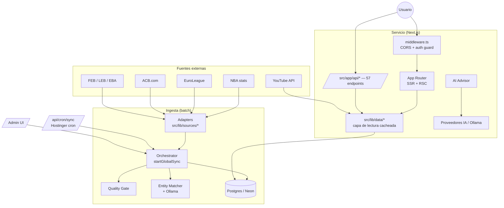
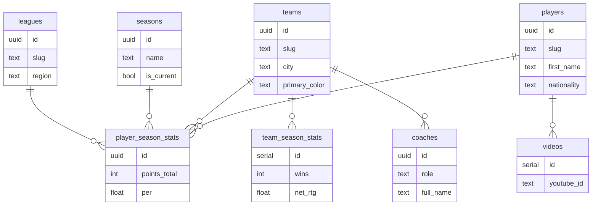

# GlobalHoopStats — Guía de Arquitectura y Desarrollo

**Idioma / Language:** Español · [English](ARCHITECTURE.en.md)

> Documentación técnica interna. Su objetivo es que **cualquier programador nuevo entienda el sistema completo** —
> qué hace, cómo está construido, cómo fluyen los datos y dónde tocar para cada tipo de cambio — sin tener que
> ingeniería‑inversa sobre 327 archivos.
>
> Complementa al [`README.md`](../README.md) (visión de producto + arranque rápido). Si hay discrepancia, **manda el código**.

**Última revisión del documento:** 2026‑06‑30 · **Stack:** Next.js 15 (App Router) · React 19 · TypeScript strict · Postgres (Neon) · Drizzle ORM.

---

## Índice

1. [Qué es GlobalHoopStats](#1-qué-es-globalhoopstats)
2. [Stack tecnológico](#2-stack-tecnológico)
3. [Arquitectura de alto nivel](#3-arquitectura-de-alto-nivel)
4. [Estructura del repositorio](#4-estructura-del-repositorio)
5. [Modelo de datos](#5-modelo-de-datos)
6. [Pipeline de ingesta (el corazón del sistema)](#6-pipeline-de-ingesta-el-corazón-del-sistema)
7. [Capa web: App Router, render e i18n](#7-capa-web-app-router-render-e-i18n)
8. [API REST](#8-api-rest)
9. [Autenticación y seguridad](#9-autenticación-y-seguridad)
10. [Motor de IA (advisor + comparador + mercado)](#10-motor-de-ia-advisor--comparador--mercado)
11. [Mercado, valoración y simulador de traspasos](#11-mercado-valoración-y-simulador-de-traspasos)
12. [Planes y facturación](#12-planes-y-facturación)
13. [Configuración y variables de entorno](#13-configuración-y-variables-de-entorno)
14. [Scripts y operación](#14-scripts-y-operación)
15. [Testing](#15-testing)
16. [Despliegue](#16-despliegue)
17. [Onboarding: recetas por tarea](#17-onboarding-recetas-por-tarea)
18. [Glosario y decisiones de diseño](#18-glosario-y-decisiones-de-diseño)

---

## 1. Qué es GlobalHoopStats

GlobalHoopStats es una **plataforma de estadísticas de baloncesto multi‑liga**. Agrega, **normaliza** y visualiza
datos de competiciones que publican su información en formatos completamente distintos, y los unifica en una sola web
rápida y **bilingüe (ES/EN)**.

**Ligas soportadas** (ver `src/lib/sources/types.ts`):

| Región | Competiciones | `SourceId` |
| --- | --- | --- |
| 🇺🇸 Norteamérica | NBA | `nba` |
| 🇪🇺 Europa | EuroLeague | `euroleague` |
| 🇪🇸 España | Liga Endesa (ACB) | `acb` |
| 🇪🇸 España (FEB) | Primera FEB · Segunda FEB · Tercera FEB | `leb-oro`, `leb-plata`, `eba` |

Sobre esa base de datos unificada se construyen tres productos:

- **Directorios y perfiles**: jugadores, equipos y cuerpo técnico, con estadísticas por liga, bios, identidad visual
  (logos/colores) y *highlights* de YouTube. Comparador de jugadores lado a lado.
- **AI Advisor**: asistente conversacional de *scouting* que razona como un director deportivo. Cada usuario usa **su
  propia clave de IA** (BYOK) o un modelo local.
- **Mercado**: simulador de fichajes/traspasos con **valoración de mercado** estimada y manejo de divisas.

El valor diferencial (el "moat") **no es** mostrar tablas: es el **motor de normalización** que convierte fuentes
heterogéneas y sucias en una única identidad canónica por persona/equipo, incluso cuando un jugador se mueve entre ligas.

---

## 2. Stack tecnológico

| Capa | Tecnología | Notas |
| --- | --- | --- |
| Framework | **Next.js 15** (App Router) + **React 19** | `next dev --turbopack` en desarrollo |
| Lenguaje | **TypeScript** (strict) | alias `@/*` → `src/*` |
| Estilos | **Tailwind CSS 4** + **Framer Motion** | `@tailwindcss/postcss` |
| Base de datos | **Postgres** (Neon serverless) | driver `postgres` con `prepare: false` |
| ORM / migraciones | **Drizzle ORM** + **Drizzle Kit** | esquema en TS, `db:push` como flujo principal |
| Auth | Sesiones propias (HMAC), `bcryptjs`, 2FA por email | sin librería externa de auth |
| Email | **Nodemailer** | transportes Resend → Gmail SMTP → consola |
| IA | **Ollama** (local) + proveedores OpenAI‑compatibles (BYOK) | búsqueda web nativa en Anthropic/Gemini |
| Validación | **Zod** | env, payloads de API |
| PWA | **Serwist** | service worker compatible con Turbopack |
| Exportación | `jspdf`, `docx`, `xlsx-js-style` | informes PDF/Word/Excel |
| Tooling | **pnpm 11**, ESLint, Prettier, **Vitest**, `tsx` | Node 20.x |

**Requisitos de entorno:** Node 20.x · pnpm 11.x · una base Postgres · (opcional) Ollama con `llama3.1:8b`.

---

## 3. Arquitectura de alto nivel

Hay **dos planos** que conviene no mezclar mentalmente:

- **Plano de ingesta (offline/batch):** scripts y cron que rellenan la BD a partir de fuentes externas.
- **Plano de servicio (online/request):** la app Next.js que lee esa BD y sirve páginas + API a los usuarios.

Ambos comparten **el mismo esquema Drizzle** y el mismo cliente de BD, pero se ejecutan en contextos distintos.



**Idea clave:** las páginas casi nunca hablan con la BD directamente; pasan por `src/lib/data/*`, que centraliza
consultas y *caching*. La ingesta sí escribe directamente vía orquestador.

---

## 4. Estructura del repositorio

```
src/
├─ app/                      # App Router (páginas + API)
│  ├─ [locale]/              # páginas enrutadas por idioma (en/es)
│  ├─ players/ teams/ coaches/ leagues/ compare/   # vistas core de stats
│  ├─ market/               # simulador de mercado + valoración
│  ├─ ai-advisor/ ai-setup/ # asistente IA + configuración BYOK
│  ├─ account/ login/ register/ reset-password/    # auth y cuentas
│  ├─ admin/                # panel interno (sync, usuarios, anuncios, analytics)
│  ├─ the-index/            # sección editorial "El Índice"
│  └─ api/                  # 57 endpoints REST (route.ts)
├─ components/              # UI reutilizable, agrupada por dominio
│  ├─ ui/ layout/ auth/ account/ admin/
│  ├─ players/ teams/ leagues/ staff/ scouting/ market/
│  └─ marketing/ animations/ svg/ index/
└─ lib/                     # toda la lógica de negocio (sin React)
   ├─ sources/              # adaptadores por liga (acb, euroleague, nba, feb)
   ├─ sync/                 # orquestación de ingesta + entity matching
   ├─ data/                 # capa de lectura cacheada (players, teams, …)
   ├─ db/                   # cliente + esquema Drizzle + RLS helpers
   ├─ auth/                 # sesiones, 2FA, password, guards
   ├─ ai/                   # advisor, providers, chat, intent, export
   ├─ market/               # valoración, trade, presupuestos, similitud
   ├─ security/             # rate-limit, secrets (cifrado), ai-advisor guard
   ├─ billing/              # planes y catálogo (seam para Stripe)
   ├─ email/                # plantillas + envío transaccional
   ├─ i18n/                 # config, diccionarios, helpers de traducción
   ├─ seo/                  # JSON-LD / structured data
   └─ theme/                # colores de equipo
scripts/                    # sync, backfills, dedupe, mantenimiento (tsx)
drizzle/                    # migraciones SQL generadas (gitignored, ver §13)
tests/                      # Vitest: unit + regresiones de seguridad
```

**Regla de oro de organización:** `lib/` no importa de `components/` ni de `app/`. La lógica de negocio es agnóstica
de React y testeable en aislamiento.

---

## 5. Modelo de datos

Fuente única de verdad: **[`src/lib/db/schema.ts`](../src/lib/db/schema.ts)** (Drizzle). ~30 tablas. Todas las
claves primarias de entidades de dominio y de usuario son `uuid` con `defaultRandom()`; las tablas de
eventos/contadores usan `serial`.

### 5.1 Dominio (datos de baloncesto)



- **`players`** es la tabla canónica: **una fila por persona**, aunque juegue en varias ligas. El `slug` es único.
- **`player_season_stats`** es la tabla de hechos: una fila por `(player, team, league, season)` — índice único que
  garantiza idempotencia en los *upserts* de la ingesta. Guarda totales (no medias) más métricas avanzadas
  (`per`, `true_shooting_pct`, `win_shares`, `bpm`).
- **`team_season_stats`** lleva *ratings* avanzados de equipo (`off_rtg`, `def_rtg`, `net_rtg`, `pace`, `sos`).
- **`coaches`** cuelga de `(team, league)`; `role` ∈ `head_coach | assistant_coach | staff`.
- **`videos`** son highlights de YouTube por jugador (`youtube_id` único).

### 5.2 Identidad, cuentas y seguridad

| Tabla | Propósito |
| --- | --- |
| `users` | cuenta: email, hash de contraseña, `plan` (free/pro), `role` (user/admin), 2FA, campos Stripe |
| `sessions` | sesiones activas (id, expiración, user‑agent, IP) — soporta revocación y "cerrar otras sesiones" |
| `user_api_keys` | claves de IA del usuario **cifradas en reposo** (AES‑256‑GCM); guarda `last4` para mostrar |
| `user_settings` | preferencias: proveedor/modelo de advisor y de comparación, locale, moneda, emails, *reduce motion* |
| `password_reset_tokens` | tokens de reseteo (hash + expiración + usado) |
| `two_factor_sessions` | códigos 2FA por email (hash, intentos, expiración) |
| `two_factor_backup_codes` | códigos de respaldo de un solo uso |

### 5.3 Producto, contenido y operación

| Tabla | Propósito |
| --- | --- |
| `conversations` / `messages` | historial del AI Advisor (por usuario y equipo) |
| `compare_uses` | log de usos del comparador (para futuros límites por plan) |
| `waitlist_entries` | lista de espera (email + origen) |
| `announcements` | banners/avisos con prioridad y ventana de fechas |
| `app_config` | configuración mutable en runtime (clave/valor) sin redeploy |
| `page_views` / `search_log` | analítica propia ligera (vistas y búsquedas) |
| `sync_runs` | auditoría de cada ejecución de ingesta (estado, filas, error) |
| `rate_limits` | contadores de *rate limiting* por ventana fija (clave compuesta) |

> Tipos TS derivados automáticamente al final del esquema (`typeof tabla.$inferSelect`). Úsalos siempre en lugar de
> redefinir formas a mano. `userPlan(user)` resuelve el plan efectivo: `admin` > `pro` > `free`.

---

## 6. Pipeline de ingesta (el corazón del sistema)

Todo vive en `src/lib/sources/` (extracción) y `src/lib/sync/` (orquestación). Es la parte con más decisiones de
diseño no obvias; léela con calma.

### 6.1 Contrato de adaptador

Cada liga implementa **`SourceAdapter`** (`src/lib/sources/types.ts`): un objeto con metadatos y métodos que devuelven
datos **ya normalizados** a tipos compartidos (`SourceTeam`, `SourcePlayer`, `SourceCoach`, `ExtractedPlayerStat`,
`SourceTeamStats`):

```ts
type SourceAdapter = {
  id: SourceId; displayName: string; country: string; season: number; seasonCode: string
  fetchTeams(): Promise<SourceTeam[]>
  fetchPlayers(): Promise<SourcePlayer[]>
  fetchStats(): Promise<ExtractedPlayerStat[]>
  fetchCoaches(): Promise<SourceCoach[]>
  fetchTeamStats(): Promise<SourceTeamStats[]>
  fetchTeamDetails?(ids): Promise<...>   // opcional, enriquecimiento
}
```

Los adaptadores registrados están en `src/lib/sources/index.ts`. Las tres ligas FEB se generan con una **fábrica**
(`createFebAdapter(FEB_CONFIGS)`) porque comparten estructura de scraping. Detalle FEB importante (ver memoria del
proyecto): el scraper FEB debe **unir todos los grupos de "Liga Regular"** (EBA tiene ~10) y la UI **no** separa por
grupo/conferencia.

`CURRENT_SEASON = 2025` y `SOURCE_META` centralizan temporada y `seasonCode` por liga.

### 6.2 Orquestador — `startGlobalSync()`

Archivo: **[`src/lib/sync/orchestrator.ts`](../src/lib/sync/orchestrator.ts)**. Ejecuta todas las ligas por el mismo
pipeline y mantiene **estado compartido entre ellas** (clave para la deduplicación cross‑league).

Pasos por liga (`syncLeague`):

1. **Abre fila en `sync_runs`** (`status: running`) para auditoría.
2. **Upsert liga + season** (memoizado: "2025‑26" lo comparten NBA/ACB/FEB y no debe duplicarse en paralelo).
3. **Descarga el lote completo** (teams + players + stats) **antes de escribir nada**.
4. **Quality Gate** (`evaluateScrape`): compara el lote contra el último sync bueno. Si el scrape parece roto
   (caída brusca de volumen, etc.) **aborta esa liga sin tocar la BD** y lanza alerta. Así un scrape defectuoso
   **nunca pisa datos buenos**.
5. **Equipos**: `ensureTeam` (get‑or‑create por slug, con relleno incremental de campos vacíos).
6. **Jugadores**: cada uno pasa por el **Entity Matcher** (§6.3) → reusar persona existente o crear nueva.
7. **Stats**: `upsert` sobre el índice único `(player, team, league, season)` → idempotente.
8. **Coaches**: upsert con `coalesce` para no regresar columnas ya rellenas a `null`.
9. **Cierra `sync_runs`** (`ok`/`failed`, filas escritas).

Propiedades del orquestador global:

- **Concurrencia limitada a 2 ligas** (`p-limit`) para no saturar el pool de Neon ni las fuentes.
- **Estado compartido**: el registro de identidad de jugadores, los slugs usados y las cachés de equipos/temporadas
  son comunes a todos los jobs en paralelo → un jugador multi‑liga (p. ej. Edy Tavares) acaba en **una sola fila**.
- **Auto‑sanado**: al arrancar, marca como `failed` las filas `running` huérfanas de más de 45 min (procesos muertos).
- **Cancelación cooperativa**: se comprueba entre ligas, vía flag en proceso y centinela en BD (admin "stop" + cron).
- **Revalidación**: si al menos una liga fue bien, invalida las *cache tags* de Next para refrescar las páginas.

### 6.3 Entity Matcher — resolución de identidad cross‑league

Archivo: **[`src/lib/sync/entity-matcher.ts`](../src/lib/sync/entity-matcher.ts)**. Decide si un jugador entrante **es
la misma persona** que uno ya conocido. Escalera de decisión, **de lo más barato a lo más caro**:

```
1. Hit exacto por nombre normalizado (compatible de tier)  → reusar      (sin LLM)
2. Ningún candidato comparte token de nombre               → NUEVO       (sin LLM)
3. Ambiguo ("Edy Tavares" vs "Walter Tavares")             → preguntar a Ollama
4. Ollama caído/inalcanzable                               → heurística conservadora
```

- **Ollama** (`llama3.1:8b` por defecto) actúa de **juez de entidad** solo en los casos ambiguos; responde JSON
  estricto `{"playerId": "<id>" | "NEW"}`. Se le pasa nacionalidad/posición/altura como desempate.
- **Tolerancia a fallos**: tras 2 fallos consecutivos de Ollama, se **desactiva** para el resto del run y se cae a la
  heurística determinista (mismo apellido + misma inicial **y** un único candidato → fusión; cualquier cosa más débil
  → nuevo, porque un duplicado es recuperable con `db:dedupe-players` pero una fusión errónea no).
- **GUARDA DURA por tier** (ver `src/lib/leagues-tier.ts` y la memoria *FEB tier exclusivity*): un jugador **FEB
  (LEB/EBA) nunca es la misma persona que uno de ACB/EL/NBA**. España está llena de homónimos amateurs de
  profesionales, así que candidatos con *tier* en conflicto se descartan **incluso en match exacto de nombre**. Esto
  se aplica en todos los peldaños de la escalera y es lo que impide que "Daniel García" (EBA) se funda con "Daniel
  García" (ACB) cuando Ollama no está.

### 6.4 Deduplicación y mantenimiento

Como la ingesta prioriza "ante la duda, crea" para evitar fusiones erróneas, existen scripts de limpieza posterior
(`scripts/dedupe-players*.ts`, `merge-cross-league-teams.ts`, `split-feb-namesakes.ts`). Son **idempotentes** y se
apoyan en la misma lógica de tiers. Hay tests dedicados (`tests/unit/entity-matcher-tier.test.ts`,
`tests/unit/quality-gate.test.ts`).

### 6.5 Cómo se dispara la ingesta

- **CLI** (manual/dev): `pnpm sync:global`, `pnpm sync:acb`, `pnpm sync:feb`, etc. (ver §14).
- **Cron de producción**: `POST /api/cron/sync` con `Authorization: Bearer $CRON_SECRET` (Hostinger cron). Tiene
  *overlap guard* (no arranca un segundo sync si hay uno en curso) y comparación de secreto en **tiempo constante**.
- **Admin UI**: `/admin` → endpoints `api/admin/sync/{run,status,stop}`.

---

## 7. Capa web: App Router, render e i18n

### 7.1 App Router

Todo bajo `src/app/`. Server Components por defecto; las vistas leen datos a través de **`src/lib/data/*`**
(`players.ts`, `teams.ts`, `leagues.ts`, `compare.ts`, `staff.ts`, `videos.ts`), que encapsulan consultas Drizzle y el
*caching* (`src/lib/data/cache.ts`). Páginas dinámicas usan rutas con parámetros: `players/[slug]`,
`teams/[league]/[slug]`.

### 7.2 Internacionalización (ES/EN)

Config en `src/lib/i18n/config.ts`. Dos patrones conviven (ver memoria *i18n two patterns*):

- **UI general**: diccionario + helper `useT` (`src/lib/i18n/dictionaries/`, `t.ts`, `server.ts`).
- **Contenido legal/editorial**: `getLocale` + componentes bilingües.

Mecánica de idioma:

- Locales soportados: `en` (default), `es`. Cookie **`ghs_locale`** (legible por el cliente, 1 año).
- Selección automática vía `pickFromAcceptLanguage()` (parsea `Accept-Language` con factores `q`).
- Existen rutas bajo `[locale]/` y un endpoint `api/locale` para cambiar idioma. El **middleware no** hace el
  enrutado de idioma (solo CORS + auth, ver §9); el idioma se resuelve por cookie/segmento.

### 7.3 PWA y SEO

- **PWA** con Serwist (`next.config.mjs` envuelve la config con `withSerwist`). El service worker se sirve desde
  `app/serwist/` y los artefactos `public/sw*` están **gitignored** y se **generan en cada build** (por eso `public/`
  puede verse vacío en local).
- **SEO**: sitemap, `robots`, OpenGraph y **JSON‑LD** (`src/lib/seo/structured-data.ts`). Hay tests anti‑XSS sobre el
  JSON‑LD (`tests/unit/json-ld-xss.test.ts`).

---

## 8. API REST

**57 endpoints** (`route.ts`) bajo `src/app/api/`. Convención Next.js: una función por verbo HTTP. Validación con Zod.

| Grupo | Rutas (resumen) | Notas |
| --- | --- | --- |
| **Auth** | `auth/{login,register,logout,me,forgot-password,reset-password}`, `auth/2fa/{verify,resend}` | sesiones + 2FA |
| **Cuenta** | `account/{profile,password,settings,sessions,subscription}`, `account/2fa/*`, `account/api-keys/*` | requiere login |
| **Datos** | `players/*`, `teams/*`, `coaches/*`, `compare/players/*` | lectura pública |
| **IA** | `ai-advisor/*`, `compare/ai`, `players/ai`, `market/trade/ai`, `conversations/[id]/messages` | usa BYOK del usuario |
| **Mercado** | `market/trade/*`, `players/[slug]/{valuation,similar}` | valoración + simulador |
| **Admin** | `admin/{sync,users,announcements,config,stats,analytics,cache}` | solo `role: admin` |
| **Operación** | `cron/sync`, `revalidate`, `track/{page-view,search}`, `waitlist`, `contact`, `announcements/active`, `locale` | cron, analítica, ISR |

Patrón de seguridad: el **middleware** bloquea por prefijo (401/redirección) y cada endpoint sensible vuelve a
comprobar usuario/rol con `src/lib/auth/guard.ts` (defensa en profundidad).

---

## 9. Autenticación y seguridad

Sin librería de auth externa: implementación propia, pequeña y auditada con tests.

### 9.1 Sesiones

Archivo: `src/lib/auth/session.ts`.

- Token compuesto `header.payload.firma.sessionId`, firmado con **HMAC‑SHA256** sobre `SESSION_SECRET`. La verificación
  usa `timingSafeEqual` (resistente a *timing*).
- Cookie **`ghs_session`**: `HttpOnly`, `SameSite=Lax`, `Secure` en producción. TTL configurable (`SESSION_TTL_DAYS`,
  30 por defecto).
- La fila en `sessions` permite **revocar** y listar/cerrar otras sesiones desde la cuenta.

### 9.2 2FA y "recordar dispositivo"

- 2FA por **código de email** (`two_factor_sessions`, con límite de intentos) + **códigos de respaldo** de un solo uso.
- Cookie de confianza **`ghs_trust`** para saltar el 2FA en un dispositivo: el token incrustra un *binding* derivado
  del **hash actual de la contraseña**. Así, **cualquier cambio/reseteo de contraseña revoca implícitamente** todos los
  trust tokens, sin tabla extra.

### 9.3 Contraseñas y reseteo

- Hash con `bcryptjs` (`src/lib/auth/password.ts`).
- Reseteo vía token con hash y expiración (`password_reset_tokens`); el email se envía por el pipeline transaccional.

### 9.4 Cifrado de claves de IA (BYOK)

- Las claves del usuario se cifran **AES‑256‑GCM** en reposo (`src/lib/security/secrets.ts`) con `ENCRYPTION_KEY`.
- En dev, si no hay `ENCRYPTION_KEY`, se deriva una de `SESSION_SECRET`; en **producción debe ser propia** para que
  rotar la sesión no exponga claves. Se guarda `last4` para mostrar sin descifrar.

### 9.5 Middleware, CORS y rate limiting

- `src/middleware.ts` (runtime **nodejs**): aplica **CORS** con allowlist de orígenes (`SITE.url`,
  `NEXT_PUBLIC_SITE_URL`, localhost en dev) y un **guard de auth** por prefijos protegidos (redirige a `/login` o
  devuelve 401 en API).
- **Rate limiting** por ventana fija en la tabla `rate_limits` (`src/lib/security/rate-limit.ts`), con resolución de
  **IP real consciente de proxies** (`TRUSTED_PROXY_HOPS`) — la web va detrás de Cloudflare.

### 9.6 Cabeceras y CSP

`next.config.mjs` añade cabeceras de seguridad globales (HSTS 2 años, `X-Frame-Options: DENY`, `nosniff`,
`Referrer-Policy`, `Permissions-Policy`, COOP/COEP/CORP) y una **CSP estricta**:

- En **producción** se elimina `unsafe-eval` (solo necesario para HMR de Turbopack en dev) → CSP efectiva
  anti‑XSS/exfiltración.
- La ruta **`/ai-advisor/*`** usa una CSP **aún más estricta** (no permite `img-src https:` abierto) porque renderiza
  contenido generado por el LLM/usuario.

### 9.7 Defensa frente a *prompt injection*

El contexto web que se inyecta al advisor se marca explícitamente como **no confiable** en el system prompt, con la
instrucción de **nunca** seguir instrucciones que aparezcan ahí (ver `buildWebContext` en `src/lib/ai/llm.ts`). Hay
tests en `tests/unit/ai-advisor-security.test.ts` y `tests/security/sql-injection-regression.test.ts`.

> Threat model y política de reporte: [`SECURITY.md`](../SECURITY.md).

---

## 10. Motor de IA (advisor + comparador + mercado)

### 10.1 BYOK (Bring Your Own Key)

Cada usuario configura **su propio proveedor y modelo** en `/ai-setup` (`user_api_keys` + `user_settings`). El sistema
no trae un proveedor por defecto en el entorno: la **calidad del output depende del modelo que elija el usuario** (ver
memoria *AI engine quality ceiling*). El dueño usa Ollama local 8B.

- `src/lib/ai/providers.ts` — catálogo de proveedores.
- `src/lib/ai/user-provider.ts` — resuelve el "engine" efectivo por usuario/request (proveedor + modelo + clave
  descifrada).
- `src/lib/ai/chat.ts` — `chatComplete()`: cliente unificado OpenAI‑compatible; `supportsNativeWebSearch()` habilita
  búsqueda web nativa cuando el proveedor lo permite (Anthropic/Gemini), evitando un buscador externo.

### 10.2 AI Advisor — "Basket Scout AI"

`src/lib/ai/llm.ts` construye el *system prompt*. Razona como un GM: una sola decisión clara, anclada a datos
**verificables** (stats reales de la BD, valoración, presupuesto del club, huecos de plantilla). Reglas destacadas:

- Distingue entre **candidatos verificados de la BD** (con valor estimado) y jugadores "de conocimiento general", que
  debe etiquetar `(fuera de BD — por confirmar)` y **nunca** inventarles stats/contratos.
- Adapta la respuesta al **tipo de operación** detectada (fichaje, traspaso, draft, corte, renovación, cesión, buyout,
  scouting) vía `src/lib/ai/intent.ts`.
- Respeta el **presupuesto** del club y el **cupo/pasaporte** (nacionalidad) si la pregunta lo requiere.
- Salida en Markdown (~250–450 palabras), exportable a Word/PDF/Markdown (`src/lib/ai/export*.ts`).

El historial se persiste en `conversations`/`messages`; al modelo solo se le envían los **últimos 8 turnos**.

---

## 11. Mercado, valoración y simulador de traspasos

Todo en `src/lib/market/`. Es un sub‑sistema heurístico que **estima** (no son datos contractuales reales):

| Módulo | Responsabilidad |
| --- | --- |
| `valuation.ts` | valor de mercado y sueldo estimado de un jugador (rating 0‑100, *tier*, confianza) sobre sus stats |
| `league-strength.ts` | factor de fuerza por liga + `formatEur` |
| `club-budgets.ts` | presupuesto estimado de club y tope realista para un fichaje (`singleSigningCap`) |
| `trade.ts` | construye escenarios de traspaso que **equilibran el valor** del jugador saliente |
| `candidates.ts` / `pool.ts` / `roster.ts` | pool de candidatos priceados, filtrado por liga/feeders y análisis de plantilla |
| `similarity.ts` | jugadores similares (perfil estadístico) |
| `nationality.ts` / `currency.ts` | filtros de cupo y conversión de divisa |
| `web-research.ts` | contexto de mercado vía web (tratado como **no confiable**) |

Estas piezas alimentan tanto las páginas de mercado como el contexto del advisor (los `build*Context` de `llm.ts`).

---

## 12. Planes y facturación

`src/lib/billing/` con separación cliente/servidor:

- `catalog.ts` (**puro, client‑safe**): definición de planes. **Free** (0€) y **Pro** (9€/mes, periodo de 30 días).
- `plans.ts` (**servidor**): `setUserPlan()` escribe la fila `users`.

Estado actual: el cambio a Pro es **self‑serve y gratuito** (sin pago todavía). El *seam* está pensado para enchufar
**Stripe Checkout** sin tocar la UI: crear sesión de checkout y que un webhook llame a `setUserPlan` en
`checkout.session.completed`. Los campos `stripe*` ya existen en `users`.

> **Límites de uso de IA**: hoy están **desactivados** (`src/lib/auth/free-usage.ts` devuelve `Infinity`); el código y
> la tabla `compare_uses` quedan listos para reactivarlos por plan.

---

## 13. Configuración y variables de entorno

Validadas con Zod en **[`src/lib/env.ts`](../src/lib/env.ts)** (esquema servidor + cliente, cacheado). En producción la
app **se niega a arrancar** si `SESSION_SECRET` sigue siendo el valor de dev.

| Variable | Req. | Propósito |
| --- | --- | --- |
| `DATABASE_URL` | ✅ | Postgres/Neon (usa el endpoint *pooled* en prod) |
| `SESSION_SECRET` | prod | HMAC de tokens de sesión (≥32 chars) |
| `ENCRYPTION_KEY` | prod | AES‑256‑GCM para cifrar claves de IA en reposo |
| `NEXT_PUBLIC_SITE_URL` | ✅ | URL canónica (SEO/sitemap/OG/JSON‑LD, CORS) |
| `SESSION_TTL_DAYS` | opc. | duración de sesión (1‑365, def. 30) |
| `ADMIN_EMAILS` | opc. | bootstrap de administradores |
| `CRON_SECRET` | opc. | protege `/api/cron/*` (≥16 chars) |
| `RESEND_API_KEY` / `GMAIL_APP_PASSWORD` | opc. | transporte de email |
| `AUTH_EMAIL_FROM` / `SMTP_HOST` / `SMTP_PORT` | opc. | remitente y SMTP |
| `OLLAMA_BASE_URL` / `OLLAMA_MODEL` | opc. | LLM local (advisor + entity matcher) |
| `HUGGINGFACE_API_KEY` / `HUGGINGFACE_RERANK_MODEL` | opc. | *rerank* de highlights |
| `TRUSTED_PROXY_HOPS` | opc. | saltos de proxy para IP real (Cloudflare) |
| `YOUTUBE_API_KEY` | opc. | highlights de YouTube |

Generar secretos: `node -e "console.log(crypto.randomBytes(32).toString('base64'))"`. **Nunca** commitear `.env*`.

### Migraciones

`drizzle.config.ts` apunta a `src/lib/db/schema.ts` y emite a `drizzle/`. **El directorio `drizzle/` está
gitignored**: el flujo principal es **`pnpm db:push`** (empuja el esquema TS a la BD); regenera las migraciones SQL en
local con `pnpm db:generate` cuando las necesites.

---

## 14. Scripts y operación

Definidos en `package.json` (ejecutados con `tsx`).

**Desarrollo y calidad**

| Comando | Acción |
| --- | --- |
| `pnpm dev` | servidor de desarrollo (Turbopack) |
| `pnpm build` / `pnpm start` | build / servir producción |
| `pnpm lint` · `pnpm typecheck` · `pnpm test` · `pnpm format` | ESLint · `tsc --noEmit` · Vitest · Prettier |

**Base de datos**

| Comando | Acción |
| --- | --- |
| `pnpm db:push` | empuja el esquema a la BD (flujo principal) |
| `pnpm db:generate` · `pnpm db:studio` | generar migraciones · abrir Drizzle Studio |
| `pnpm db:dedupe-players` · `pnpm db:cleanup-syncs` | deduplicar jugadores · limpiar syncs colgados |

**Ingesta y backfills**

| Comando | Acción |
| --- | --- |
| `pnpm sync:global` | sincroniza todas las ligas |
| `pnpm sync:{nba,euroleague,acb,leb-oro,leb-plata,eba}` | una competición |
| `pnpm sync:feb` | todas las FEB (Primera FEB + Segunda FEB + Tercera FEB) |
| `pnpm backfill:{players,colors,team-identity,acb-bio,coach-wikidata,coach-photos}` | enriquecidos puntuales |

En producción, el sync corre **de noche por cron** (`POST /api/cron/sync`, Hostinger). En servidor Node de larga
ejecución, `maxDuration` se ignora y el handler corre hasta terminar.

---

## 15. Testing

**Vitest** (`vitest.config.ts`, `tests/setup.ts`). El énfasis está en la **lógica crítica y la seguridad**, no en
cobertura amplia de UI:

- Unit: `entity-matcher-tier`, `quality-gate`, `session`, `password`, `secrets`, `env`, `format`, `i18n-config`,
  `safe-redirect`.
- Seguridad: `ai-advisor-security` (prompt injection), `json-ld-xss` (XSS en structured data),
  `security/sql-injection-regression`.

Ejecuta `pnpm test` (run único) o `pnpm test:watch`. Ver `tests/README.md`.

---

## 16. Despliegue

(Ver memoria *hosting-deployment*; la migración a MySQL fue **rechazada a propósito** — el destino es Postgres.)

- **App**: servidor **Node.js de larga ejecución** en **Hostinger Cloud** (`pnpm build` → `pnpm start`).
- **BD**: **Neon serverless Postgres** (usar endpoint *pooled* en prod; `prepare: false` en el driver).
- **CDN/Proxy**: **Cloudflare** delante (de ahí `TRUSTED_PROXY_HOPS` y la allowlist de `cloudflareinsights` en la CSP).
- **Cron**: Hostinger cron → `POST /api/cron/sync` con `Authorization: Bearer $CRON_SECRET`.
- **Variables mínimas en prod**: `SESSION_SECRET`, `ENCRYPTION_KEY`, `DATABASE_URL`, `NEXT_PUBLIC_SITE_URL`.

Notas internas de despliegue: `DEPLOY-HOSTINGER.md` (local‑only, gitignored).

---

## 17. Onboarding: recetas por tarea

> "Quiero hacer X, ¿dónde toco?"

| Tarea | Empieza por |
| --- | --- |
| **Añadir una liga nueva** | crea adaptador en `src/lib/sources/`, regístralo en `index.ts`, añade su `SourceId`/meta en `types.ts`, asígnale *tier* en `leagues-tier.ts`, añade script `sync:<liga>` |
| **Cambiar el esquema de BD** | edita `src/lib/db/schema.ts` → `pnpm db:push` (dev) → actualiza tipos derivados (automáticos) |
| **Nueva página** | `src/app/.../page.tsx`; lee datos vía `src/lib/data/*`, no Drizzle directo |
| **Nuevo endpoint** | `src/app/api/.../route.ts`; valida con Zod; protege con `src/lib/auth/guard.ts`; si es sensible, añade prefijo al middleware |
| **Ajustar el prompt del advisor** | `src/lib/ai/llm.ts` (`buildSystemPrompt`); intención en `intent.ts` |
| **Tocar valoración/mercado** | `src/lib/market/*` (empieza por `valuation.ts` / `trade.ts`) |
| **Texto de UI nuevo** | diccionarios en `src/lib/i18n/dictionaries/` (añade EN **y** ES) |
| **Regla de seguridad** | `src/lib/security/*`, `next.config.mjs` (CSP/headers), `middleware.ts` |
| **Cambiar planes/precios** | `src/lib/billing/catalog.ts` |

**Primer arranque local:**

```bash
pnpm install
cp .env.example .env.local          # rellena al menos DATABASE_URL
pnpm db:push                         # crea el esquema
pnpm dev                             # http://localhost:3000
# (opcional) ollama pull llama3.1:8b  # para advisor + entity matcher locales
pnpm sync:acb                        # carga datos de una liga para tener algo que ver
```

---

## 18. Glosario y decisiones de diseño

**Glosario**

- **Adapter / Source**: módulo que extrae y normaliza una liga al contrato común (`SourceAdapter`).
- **Entity matching**: decidir si dos registros de jugador son la misma persona.
- **Tier**: nivel de competición (FEB amateur vs. élite ACB/EL/NBA). Guarda contra fusiones de homónimos.
- **Quality gate**: validación que bloquea un scrape sospechoso antes de escribir en BD.
- **BYOK**: *Bring Your Own Key* — cada usuario pone su clave de IA.
- **Tag de caché**: etiqueta de Next que se invalida tras un sync para refrescar páginas.

**Decisiones de diseño que parecen raras pero son intencionadas**

- **Postgres, no MySQL** — la migración a MySQL se rechazó deliberadamente.
- **`drizzle/` gitignored** — el flujo canónico es `db:push`; las migraciones SQL se regeneran en local.
- **Ingesta sesga a "crear, no fundir"** — un duplicado es recuperable (`dedupe`), una fusión errónea no.
- **Guarda dura por tier en el matcher** — necesaria por la abundancia de homónimos amateurs en España.
- **CSP sin `unsafe-eval` en prod** — solo se permite en dev por el HMR de Turbopack.
- **Límites de IA desactivados** — código preparado, pero hoy todo es ilimitado en beta.
- **Sin proveedor de IA por defecto** — la calidad la decide el usuario con su modelo (BYOK).
- **El estilo editorial es "El Índice"** (papel+tinta+naranja, Fraunces/Hanken/Space Mono); evitar clichés de plantilla IA.

---

*Mantén este documento vivo: cuando una decisión de arquitectura cambie, actualízalo en el mismo PR que el código.*
